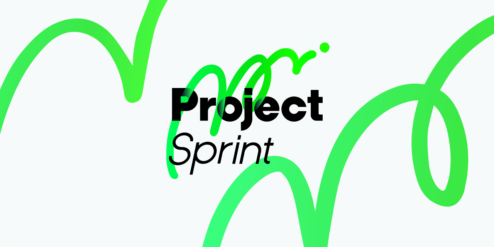

# Project Sprint

  

## 📍 Project Sprint とは

Project Sprint は、不確実な状況においてプロジェクトを前進させるためのフレームワークです。

Project Sprint では、プロジェクトを「あらかじめ定めた正解を実行する活動」ではなく、「行動を通じて理解を更新し、価値を探索する活動」と捉えます。

世界は変化しつづけています。環境や要求は常に変化し、将来を完全に予測することはできません。そのような状況において、プロジェクトを前進させるためには、計画だけでなく、行動によって得られた出力と、それをもとにした対話が必要になります。

Project Sprint は、探索と収束のリズムを通じて、多様な個人の行動をチームとして統合し、価値の実現へとつなげる仕組みを提供します。

本リポジトリでは、Project Sprint をオープンソースのフレームワークとして公開しています。

▼ 現在の最新ドキュメント

* v5.0  
  *  [Introduction](CODE/v5/v5_0_ja/introduction.md) ：まずは Project Sprint の全体像を把握しよう
  *  [Step0](CODE/v5/v5_0_ja/step0.md) ：個人としてどのように探索に参加するかを理解しよう
  *  [Step1](CODE/v5/v5_0_ja/step1.md) ：チームとしてどのように探索を進めるかを理解しよう
  *  [Key Terms](CODE/v5/v5_0_ja/keyterms.md) ：主要な用語の定義を確認しよう

▼ 体験型 Project Sprint

* [Workshop](https://gemini.google.com/gem/1sSD-IgnFHhASaWH52fsn3dHWkyMg9J9L?usp=sharing)  
  このワークショップでは、プロジェクトを推進するフレームワーク「Project Sprint」を、おひとりで体験していただけます。所要時間は15分ほどです。
  ※体験するにはご自身のGoogleアカウントが必要です

## 🙆‍♂️ こんな方におすすめ

Project Sprint は、プロジェクトを「価値を探索しつづける活動」と捉える人のためのフレームワークです。

もしあなたが、現在のプロジェクトにおいて次のような感覚を持っているなら、Project Sprint は新しい視点を提供できるかもしれません。

- 計画どおりに進めることよりも、本当に価値のあるものを実現したい
- 環境や要求の変化に振り回されるのではなく、それらを踏まえて前進したい
- 多様なメンバーの視点や専門性を、よりよい意思決定につなげたい
- 管理や指示によってではなく、自律的な協働によってチームを動かしたい
- 今のプロジェクトの進め方に違和感があり、別の可能性を探している

Project Sprint は、多くのプロジェクトに汎用的に適用可能です。

しかし、要求と実現方法の両方が明確であり、計画どおりの実行が期待できる状況においては、Project Sprint を用いる必要性は高くないかもしれません。

一方で、要求や実現方法のいずれかが不明確である場合や、状況の変化に応じて判断を更新する必要がある場合には、探索が必要です。

- 目指す成果が明確であっても、その実現方法が分からない
- 実現方法が明確であっても、要求や価値そのものが変化する

Project Sprint は、このような探索が必要な状況において、探索と収束を繰り返しながら前進するためのフレームワークです。

※ Project Sprint におけるプロジェクトの捉え方について、さらに詳しくは[こちら](CODE/v5/v5_0_ja/introduction.md)をご覧ください。 
※ Project Sprint の構築に参加するには、[こちら](https://github.com/ProjectSprintOrg/projectsprint.org/wiki/Question-and-Suggestion)をご参照ください。
